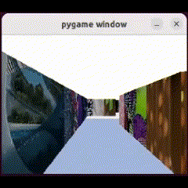

# Visual Mapping and Navigation

## Overview

This repository presents an efficient mobile robot navigation algorithm designed for maze/indoor environments. The algorithm comprises two main phases: a semi-automatic exploration phase and a fully autonomous navigation stage.

## Features

- **Vanishing Points for Pose Correction**: The system utilizes Vanishing Points for accurate robot pose correction relative to walls. This ensures precise alignment during the exploration phase.

- **SIFT/SuperGlue for Goal Localization**: To locate the goal efficiently, the algorithm employs SIFT (Scale-Invariant Feature Transform) and SuperGlue for optimal target image matching. This enables the robot to identify the goal with high accuracy.

- **A\* Path Planning Algorithm**: The A* path planning algorithm is integrated for generating the shortest path autonomously. This ensures that the robot can navigate the maze efficiently, optimizing the route for optimal results.

- **Autonomous Decision-Making**: The approach includes autonomous decision-making capabilities, allowing the robot to make informed choices during navigation. This contributes to the overall effectiveness of maze exploration and goal attainment.

## Implementation Details

- **Exploration Phase**: The algorithm starts with a semi-automatic exploration phase, where the robot systematically explores the maze environment. Vanishing Points are employed to correct the robot's pose concerning walls, ensuring comprehensive coverage.

- **Navigation Stage**: Once the exploration is complete, the system transitions to a fully autonomous navigation stage. SIFT/SuperGlue is used to match target images, pinpointing the goal location. The A* path planning algorithm then generates the shortest path for the robot to navigate the maze autonomously.


# Instructions for Execution

## 1. Installation

- Make sure you have Conda installed on your system. If not, you can download and install Conda by following the instructions on the official Conda website: [Conda Installation Guide](https://docs.conda.io/projects/conda/en/latest/user-guide/install/index.html)
   
```commandline
# Update Conda
$ conda update conda

# Clone the repository
$ git clone https://github.com/satyapalsinh10/Maze_Mapping_and_Navigation.git

# Navigate to the project directory
$ cd Maze_Mapping_and_Navigation

# Create Conda environment from environment.yaml
$ conda env create -f environment.yaml

# Activate the Conda environment
$ conda activate game
```


## 2. Executing the code

- Once the environment is set up, you can execute the code using the following command:
```commandline
$ python player_astar_test.py
```

# Results

- Once the code is executed a pygame window will be opened and will initiate the Exploration phase.
- Use `W/A/S/D` to control the robot motion and explore the environment.

<p align="center">
  
</p>

- Once the Exploration of the environment is finished press `Esc` key to initialize the SIFT similarity sequence.
- SIFT Similarity sequence compares the goal image with all the query images that were generated in the exploration phase and returns the final goal position coordinates.
- Based on the Goal position coordinates the A* will generate the shortest path.

<p align="center">
  
</p>

- `Blue` path is generated during the Exploration phase.
- `Red` Path is the shortest path to the goal posistion generated by A* algorithm.
- Close the window and press `Esc` key to initiate the Navigation Stage.
- During the Navigation stage the Robot will Autonomously navigate to the Goal Position.


# Reference
- Reference the explanation video link [here](https://drive.google.com/file/d/1xsW08TvRY4-ADaqUmq5mde-TZkeTv1r8/view?usp=sharing) for step by step execution.
  

  

